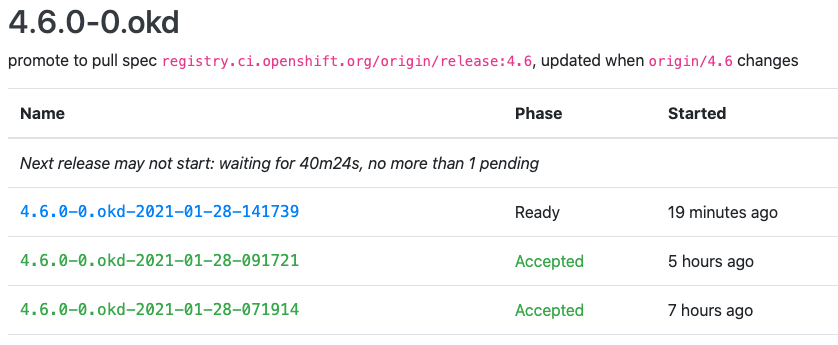

# OKD 4 Single Node Cluster

## Host setup:

You need to start with a minimal CentOS 7 install.

    wget https://buildlogs.centos.org/rolling/7/isos/x86_64/CentOS-7-x86_64-Minimal.iso

Use a tool like [balenaEtcher](https://www.balena.io/etcher/) to create a bootable USB key from a CentOS ISO.

You will have to attach monitor, mouse, and keyboard to your NUC for the install.  After the install, this machine can be headless.

* Network:
    1. Configure the network interface with a fixed IP address, `10.11.11.10` if you are following this guide.  Otherwise, use the conventions of your local network.
    1. Set the system hostname to `snc-host`
* Storage:
    1. Take the default sizes for /boot and swap.
    1. Do not create a `/home` filesystem (no users on this system)
    Allocate all of the remaining space for the `/` filesystem

After the installation completes, ensure that you can ssh to your host.

    ssh root@10.11.11.10

Install packages and set up KVM:

    yum -y install wget git net-tools bind bind-utils bash-completion nfs-utils rsync qemu-kvm libvirt libvirt-python libguestfs-tools virt-install iscsi-initiator-utils

    systemctl enable libvirtd
    systemctl start libvirtd

    mkdir /VirtualMachines
    virsh pool-destroy default
    virsh pool-undefine default
    virsh pool-define-as --name default --type dir --target /VirtualMachines
    virsh pool-autostart default
    virsh pool-start default

Set up bridged networking: 

The following assumes that your NIC is `eno1`

Create a bridge device named `br0` over the primary NIC.  Substitute your IP configuration below.

1. Edit /etc/sysconfig/network-scripts/ifcfg-br0

       STP="yes"
       BRIDGING_OPTS="priority=32768"
       TYPE="Bridge"
       PROXY_METHOD="none"
       BROWSER_ONLY="no"
       BOOTPROTO="none"
       IPADDR="10.11.11.10"      # This should be the IP address of your snc-host
       PREFIX="24"
       GATEWAY="10.11.11.1"      # This should be the IP address of your router
       DNS1="10.11.11.1"         # This should be the IP address of your router, or external DNS server
       DEFROUTE="yes"
       IPV4_FAILURE_FATAL="no"
       IPV6INIT="no"
       NAME="br0"
       DEVICE="br0"
       ONBOOT="yes"

1. Edit /etc/sysconfig/network-scripts/ifcfg-br0_slave_1

       TYPE="Ethernet"
       NAME="br0 slave 1"
       DEVICE="eno1"
       ONBOOT="yes"
       BRIDGE="br0"

1. Edit /etc/sysconfig/network-scripts/ifcfg-eno1

       NAME=eno1
       DEVICE=eno1
       ONBOOT=no
       NETBOOT=yes
       IPV6INIT=no
       TYPE=Ethernet
       PROXY_METHOD=none
       BROWSER_ONLY=no

1. Restart networking and make sure everything is working properly:

       systemctl restart network.service

Create an SSH key pair: (Take the defaults for all of the prompts, don't set a key password)

    ssh-keygen
    <Enter>
    <Enter>
    <Enter>

Update and shutdown the SNC host:

    yum -y update
    shutdown -h now

Disconnect the keyboard, mouse, and display.  Your host is now headless.  

### __Power the host up, log in via SSH, and continue the snc-host host set up.__

1. Clone this repository:

       mkdir -p /root/okd4-snc
       cd /root/okd4-snc
       git clone https://github.com/cgruver/okd4-single-node-cluster.git
       cd okd4-single-node-cluster

1. Copy the utility scripts to your local `bin` directory:

       mkdir ~/bin
       cp ./Provisioning/bin/* ~/bin
       chmod 750 ~/bin/*

    Ensure that `~/bin` is in your $PATH.  Modify ~/.bashrc if necessary.

1. One of the included utility scripts will set environment variables for the install.

    Modify `~/bin/setSncEnv.sh` to reflect your network settings.  You will need to set a domain that will be used in the DNS setup.

    | Variable | Example Value | Description |
    | --- | --- | --- |
    | `SNC_DOMAIN` | `snc.test` | The domain that you want for your lab.  This will be part of your DNS setup |
    | `SNC_HOST` | `10.11.11.10` | The IP address of your snc-host host. |
    | `SNC_NAMESERVER` | `${SNC_HOST}` | The IP address of your snc-host host. |
    | `SNC_NETMASK` | `255.255.255.0` | The netmask of your local network |
    | `SNC_GATEWAY` | `10.11.11.1` | The IP address of your local router |
    | `INSTALL_HOST_IP` | `${SNC_HOST}` | The IP address of your snc-host host. |
    | `INSTALL_ROOT` | `/usr/share/nginx/html/install` | The directory that will hold Fedora CoreOS install images |
    | `INSTALL_URL` | `http://${SNC_HOST}/install` | The URL for Fedora CoreOS installation |
    | `OKD4_SNC_PATH` | `/root/okd4-snc` | The path from which we will build our OKD4 cluster |
    | `OKD_REGISTRY` | `registry.svc.ci.openshift.org/origin/release` | The URL for the OKD4 nightly build images |
    | `LOCAL_SECRET_JSON` | `${OKD4_SNC_PATH}/pull-secret.json` | The path to the pull secret needed for accessing the OKD4 images |

    After you you have completed any necessary modifications, add this script to ~/.bashrc so that it will execute on login.

       echo ". /root/bin/setSncEnv.sh" >> ~/.bashrc

    Now, set the environment in your local shell:

       . /root/bin/setSncEnv.sh

## DNS Configuration

OKD requires a DNS configuration.  To satisfy that requirement, we will set up bind.  

This tutorial includes pre-configured files for you to modify for your specific installation.  These files will go into your `/etc` directory.  You will need to modify them for your specific setup.

    /etc/named.conf
    /etc/named/named.conf.local
    /etc/named/zones/db.10.11.11
    /etc/named/zones/db.domain.records

__If you set up your router for the 10.11.11/24 network, then you can use the example DNS files as they are for this exercise.  Otherwise, you will need to modify the IP addresses to reflect your local network__

Do the following, from the root of this project:

    cp ./DNS/named.conf /etc
    cp -r ./DNS/named /etc
    
    mv /etc/named/zones/db.domain.records /etc/named/zones/db.${SNC_DOMAIN}
    sed -i "s|%%SNC_DOMAIN%%|${SNC_DOMAIN}|g" /etc/named/named.conf.local
    sed -i "s|%%SNC_DOMAIN%%|${SNC_DOMAIN}|g" /etc/named/zones/db.${SNC_DOMAIN}
    sed -i "s|%%SNC_DOMAIN%%|${SNC_DOMAIN}|g" /etc/named/zones/db.10.11.11

Now let's talk about this configuration, starting with the A records, (forward lookup zone).  If you did not use the 10.11.11/24 network as illustrated, then you will have to edit the files to reflect the appropriate A and PTR records for your setup.

In the example file, there are some entries to take note of:
  
1. The SNC Host is `snc-host`.
1. The Bootstrap node is `okd4-snc-bootstrap`.
1. The Master node for the single node cluster is `okd4-snc-master`.
1. The etcd host is also the master node `etcd-0`
1. There is one wildcard record that OKD needs: __`okd4-snc` is the name of the cluster.__
  
        *.apps.okd4-snc.your.domain.org
   
     The "apps" record will be for all of the applications that you deploy into your OKD cluster.

     This wildcard A record needs to point to the entry point for your OKD cluster.  In this case, the wildcard A record will point to the IP address of your single master node.
1. There are two A records for the Kubernetes API, internal & external.  

       api.okd4-snc.your.domain.org.        IN      A      10.10.11.50
       api-int.okd4-snc.your.domain.org.    IN      A      10.10.11.50

1. There is one SRV record for the etcd host, which is also the master node.

       _etcd-server-ssl._tcp.okd4-snc.your.domain.org    86400     IN    SRV     0    10    2380    etcd-0.okd4.your.domain.org.

1. We are going to take advantage of DNS round-robin for this installation, since we are not using an external load balancer.  Thus, there are duplicate entries for the `api` and `api-int` A records.  The duplicate entries point to the bootstrap node.  These entries will be removed when the cluster bootstrap is completed.

       api.okd4-snc.your.domain.org.        IN      A      10.10.11.49 ; remove after bootstrap
       api-int.okd4-snc.your.domain.org.    IN      A      10.10.11.49 ; remove after bootstrap

When you have completed all of your configuration changes, you can test the configuration with the following command:

    named-checkconf

If the output is clean, then you are ready to fire it up!

### Starting DNS

Now that we are done with the configuration let's enable DNS and start it up.

    firewall-cmd --permanent --add-service=dns
    firewall-cmd --reload
    systemctl enable named
    systemctl start named

Finally, we need to configure the `snc-host` to use the new DNS server

1. Edit /etc/sysconfig/network-scripts/ifcfg-br0 and change the DNS entry to reflect the IP address of the `snc-host`

       STP="yes"
       BRIDGING_OPTS="priority=32768"
       TYPE="Bridge"
       PROXY_METHOD="none"
       BROWSER_ONLY="no"
       BOOTPROTO="none"
       IPADDR="10.11.11.10"
       PREFIX="24"
       GATEWAY="10.11.11.1"
       DNS1="10.11.11.10"          # This line should now be the IP address of this host.
       DEFROUTE="yes"
       IPV4_FAILURE_FATAL="no"
       IPV6INIT="no"
       NAME="br0"
       DEVICE="br0"
       ONBOOT="yes"

1. Restart networking and make sure everything is working properly:

       systemctl restart network.service

1. You can now test DNS resolution.  Try some `ping` or `dig` commands.

       ping redhat.com

### __Hugely Helpful Tip:__

__If you are using a MacBook for your workstation, you can enable DNS resolution to your lab by creating a file in the `/etc/resolver` directory on your Mac.__

    sudo bash
    <enter your password>
    vi /etc/resolver/your.domain.com

Name the file `your.domain.com` after the domain that you created for your SNC lab.  Enter something like this example, modified for your DNS server's IP:

    nameserver 10.11.11.10

Save the file.

Your MacBook should now query your new DNS server for entries in your new domain.  __Note:__ If your MacBook is on a different network and is routed to your Lab network, then the `acl` entry in your DNS configuration must allow your external network to query.  Otherwise, you will bang your head wondering why it does not work...

## Nginx Configuration

We are going to install the Nginx HTTP server and configure it to serve up the Fedora CoreOS installation images and the ignition config files.

Open firewall ports for HTTP/S so that we can access the Nginx server:

    firewall-cmd --permanent --add-service=http
    firewall-cmd --permanent --add-service=https
    firewall-cmd --reload

Install and start Nginx:

    yum -y install nginx
    systemctl enable nginx
    systemctl start nginx

Create the directory structure for the Fedora CoreOS install files.

    mkdir -p /usr/share/nginx/html/install/fcos/ignition

## Prepare to Install the OKD 4.4 Single Node Cluster

I have provided a set of utility scripts to automate a lot of the tasks associated with deploying and tearing down an your OKD cluster.  In your `~/bin` directory you will see the following:

| | |
|-|-|
| `DeployOkdSnc.sh` | Creates the Bootstrap and Master nodes, and starts the installation |
| `DestroyBootstrap.sh` | Destroys the Bootstrap node |
| `sncPostInstall.sh` | Post cluster install script to set up the cluster for use |
| `UnDeployOkdSnc.sh` | Destroys the single node cluster |

1. Retrieve the `oc` command.  We're going to grab an older version of `oc`, but that's OK.  We just need it to retrieve to current versions of `oc` and `openshift-install`

    Go to: `https://github.com/openshift/okd/releases/tag/4.4.0-0.okd-2020-01-28-022517` and retrieve the `openshift-client-linux-4.4.0-0.okd-2020-01-28-022517.tar.gz` archive.

       cd ${OKD4_SNC_PATH}
       wget https://github.com/openshift/okd/releases/download/4.4.0-0.okd-2020-01-28-022517/openshift-client-linux-4.4.0-0.okd-2020-01-28-022517.tar.gz

1. Uncompress the archive and move the `oc` executable to your ~/bin directory.

       tar -xzf openshift-client-linux-4.4.0-0.okd-2020-01-28-022517.tar.gz
       mv oc ~/bin
       mv kubectl ~/bin
       rm -f openshift-client-linux-4.4.0-0.okd-2020-01-28-022517.tar.gz
       rm -f README.md

    The `DeployOkdSnc.sh` script will pull the correct version of `oc` and `openshift-install` when we run it.  It will over-write older versions in `~/bin`.

1. Now, we need a pull secret.  

   The first one is for quay.io.  If you don't already have an account, go to `https://quay.io/` and create a free account.

   Once you have your account, you need to extract your pull secret.

   1. Log into your new Quay.io account.
   1. In the top left corner, click the down arrow next to your user name.  This will expand a menu
   1. Select `Account Settings`
   1. Under `Docker CLI Password`, click on `Generate Encrypted Password`
   1. Type in your quay.io password
   1. Select `Kubernetes Secret`
   1. Select `View <your-userid>-secret.yml`
   1. Copy the base64 encoded string under `.dockerconfigjson`

        It will look something like:

           ewoblahblahblahblahblahblahblahREDACTEDetc...IH0KfQ==

        But much longer...
    1. We need to put the pull secret into a JSON file that we will use to set up the install-config.yaml file.

           echo "PASTE THE COPIED BASE64 STRING HERE" | base64 -d > ${OKD4_SNC_PATH}/pull_secret.json 

1. We need to configure the environment to pull a current version of OKD.  So point your browser at `https://origin-release.svc.ci.openshift.org`.  

    

    Select the most recent 4.4.0-0.okd release that is in a Phase of `Accepted`, and copy the release name into an environment variable:

       export OKD_RELEASE=4.4.0-0.okd-2020-03-23-073327

1. The next step is to prepare the install-config.yaml file that `openshift-install` will use it to create the `ignition` files for bootstrap and master nodes.

    I have prepared a skeleton file for you in this project, `./install-config-snc.yaml`.

       apiVersion: v1
       baseDomain: %%SNC_DOMAIN%%
       metadata:
         name: okd4-snc
       networking:
         networkType: OpenShiftSDN
         clusterNetwork:
         - cidr: 10.100.0.0/14 
           hostPrefix: 23 
         serviceNetwork: 
         - 172.30.0.0/16
       compute:
       - name: worker
         replicas: 0
       controlPlane:
         name: master
         replicas: 1
       platform:
         none: {}
       pullSecret: '%%PULL_SECRET%%'
       sshKey: %%SSH_KEY%%

    Copy this file to our working directory.

        cp ./install-config-snc.yaml ${OKD4_SNC_PATH}/install-config-snc.yaml

    Patch in some values:

        sed -i "s|%%SNC_DOMAIN%%|${SNC_DOMAIN}|g" ${OKD4_SNC_PATH}/install-config-snc.yaml
        SECRET=$(cat ${OKD4_SNC_PATH}/pull-secret.json)
        sed -i "s|%%PULL_SECRET%%|${SECRET}|g" ${OKD4_SNC_PATH}/install-config-snc.yaml
        SSH_KEY=$(cat ~/.ssh/id_rsa.pub)
        sed -i "s|%%SSH_KEY%%|${SSH_KEY}|g" ${OKD4_SNC_PATH}/install-config-snc.yaml

    Your install-config-snc.yaml file should now look something like:

       apiVersion: v1
       baseDomain: your.domain.org
       metadata:
         name: okd4-snc
       networking:
         networkType: OpenShiftSDN
         clusterNetwork:
         - cidr: 10.100.0.0/14 
           hostPrefix: 23 
         serviceNetwork: 
         - 172.30.0.0/16
       compute:
       - name: worker
         replicas: 0
       controlPlane:
         name: master
         replicas: 1
       platform:
         none: {}
       pullSecret: '{"auths": {"quay.io": {"auth": "Y2dydREDACTEDREDACTEDHeGtREDACTEDREDACTEDU55NWV5MREDACTEDREDACTEDM4bmZB", "email": ""},"nexus.oscluster.clgcom.org:5002": {"auth": "YREDACTEDREDACTED==", "email": ""}}}'
       sshKey: ssh-rsa AAAREDACTEDREDACTEDAQAREDACTEDREDACTEDMnvPFqpEoOvZi+YK3L6MIGzVXbgo8SZREDACTEDREDACTEDbNZhieREDACTEDREDACTEDYI/upDR8TUREDACTEDREDACTEDoG1oJ+cRf6Z6gd+LZNE+jscnK/xnAyHfCBdhoyREDACTEDREDACTED9HmLRkbBkv5/2FPpc+bZ2xl9+I1BDr2uREDACTEDREDACTEDG7Ms0vJqrUhwb+o911tOJB3OWkREDACTEDREDACTEDU+1lNcFE44RREDACTEDREDACTEDov8tWSzn root@snc-host

1. Set a couple of environment variables that the `DeployOkdSnc` script will use for Fedora CoreOS installation. 

    In a browser, go to: `https://getfedora.org/en/coreos/download/`

    Make sure you are on the `stable` Stream, select the `Bare Metal & Virtualized` tab, and make note of the current version. 

    

    Set the FCOS version as a variable.  For example:

       FCOS_VER=31.20200223.3.0

    Set the FCOS_STREAM variable to `stable` or `testing` to match the stream that you are pulling from.

       FCOS_STREAM=stable

1. Create the cluster virtual machines and start the OKD installation:

       DeployOkdSnc.sh

    This script does a whole lot of work for you:

    1. It will pull the current versions of `oc` and `openshift-install` based on the value of `${OKD_RELEASE}` that we set previously.
    1. Copies the install-config-snc.yaml file to the install directory as install-config.yaml.
    1. Invokes the openshift-install command against our install-config to produce ignition files
    1. Copies the ignition files into place for FCOS install
    1. Pulls the requested Fedora CoreOS release based on the values of `${FCOS_VER}` and `${FCOS_STREAM}`
    1. Creates a bootable ISO for the Bootstrap and Master nodes with a customized `isolinux.cfg` file.
    1. Creates the guest VMs for the Boostrap and Master nodes.
    1. Starts the VMs and begins the installation process.

1. Because the `DeployOkdSnc.sh` script disconnects from the VM before installation completes, the VM will not restart after the Fedora CoreOS installation.  The VMs will shutdown instead.

    You can watch the install:

       virsh console okd4-snc-bootstrap
       virsh console okd4-snc-master
    
    When the install is complete, the VMs will be shutdown:

       virsh list --all

        Id    Name                           State
       ----------------------------------------------------
        -     okd4-snc-bootstrap             shut off
        -     okd4-snc-master                shut off

1. Restart the VMs to begin the OKD Cluster installation:

       virsh start okd4-snc-bootstrap
       virsh start okd4-snc-master

### Now let's sit back and watch the install:

1. In a separate terminal, execute the following to monitor the Bootstrap progress:

       openshift-install --dir=${OKD4_SNC_PATH}/okd4-install-dir wait-for bootstrap-complete --log-level debug

    __We are waiting for the API to be available so that we can inject a setting to allow for a single node cluster to run:__

1. When you see the following message... 

       INFO API v1.17.1 up                               
       INFO Waiting up to 40m0s for bootstrapping to complete... 

    execute the following commands:

       export KUBECONFIG="${OKD4_SNC_PATH}/okd4-install-dir/auth/kubeconfig"
       oc patch etcd cluster -p='{"spec": {"unsupportedConfigOverrides": {"useUnsupportedUnsafeNonHANonProductionUnstableEtcd": true}}}' --type=merge

    If the command fails, try it again until it succeeds.  The `etcd` operator config may not be available for patching right away.

    You might see errors like:

       error: the server doesn't have a resource type "etcd"
    
    Or:

       Error from server (NotFound): etcds.operator.openshift.io "cluster" not found

    Keep trying, it should succeed in a minute or two at most.

1. Now, wait for the bootstrap to complete:

       openshift-install --dir=${OKD4_SNC_PATH}/okd4-install-dir wait-for bootstrap-complete --log-level debug

1. When the Bootstrap process is complete, destroy the Bootstrap node.

       DestroyBootstrap.sh

1. Now, watch the installation process through to completion:

       openshift-install --dir=${OKD4_SNC_PATH}/okd4-install-dir wait-for install-complete --log-level debug

### Watching Bootstrap and Install processes in detail:

To watch a node boot and install:

* Bootstrap node:
  
       virsh console okd4-snc-bootstrap

* Master Node:

       virsh console okd4-snc-master

Once a host has installed FCOS you can monitor the install logs:
* Bootstrap Node:

       ssh -o StrictHostKeyChecking=no -o UserKnownHostsFile=/dev/null core@okd4-snc-bootstrap "journalctl -b -f -u bootkube.service"

* Master Node:

       ssh -o StrictHostKeyChecking=no -o UserKnownHostsFile=/dev/null core@okd4-master-0 "journalctl -b -f -u kubelet.service"

### If it all goes pancake shaped:

Gather logs from the bootstrap and master nodes:

    openshift-install --dir=okd4-install gather bootstrap --bootstrap 10.11.11.49 --master 10.11.11.50

## Install Complete:

    You will see output that looks like:

      INFO Waiting up to 10m0s for the openshift-console route to be created... 
      DEBUG Route found in openshift-console namespace: console 
      DEBUG Route found in openshift-console namespace: downloads 
      DEBUG OpenShift console route is created           
      INFO Install complete!                            
      INFO To access the cluster as the system:admin user when using 'oc', run 'export KUBECONFIG=/root/okd4-snc/okd4-install-dir/auth/kubeconfig' 
      INFO Access the OpenShift web-console here: https://console-openshift-console.apps.okd4-snc.your.domain.org 
      INFO Login to the console with user: kubeadmin, password: aBCdE-FGHiJ-klMNO-PqrSt

### Log into your new cluster console:

Point your browser to the url listed at the completion of install: `https://console-openshift-console.apps.okd4-snc.your.domain.org`
Log in as `kubeadmin` with the password from the output at the completion of the install.

__If you forget the password for this initial account, you can find it in the file: `${OKD4_SNC_PATH}/okd4-install-dir/auth/kubeadmin-password`

### Issue commands against your new cluster:

    export KUBECONFIG="${OKD4_SNC_PATH}/okd4-install-dir/auth/kubeconfig"
    oc get pods --all-namespaces

Create an Empty volume for registry storage:

    oc patch configs.imageregistry.operator.openshift.io cluster --type merge --patch '{"spec":{"managementState":"Managed","storage":{"emptyDir":{}}}}'

