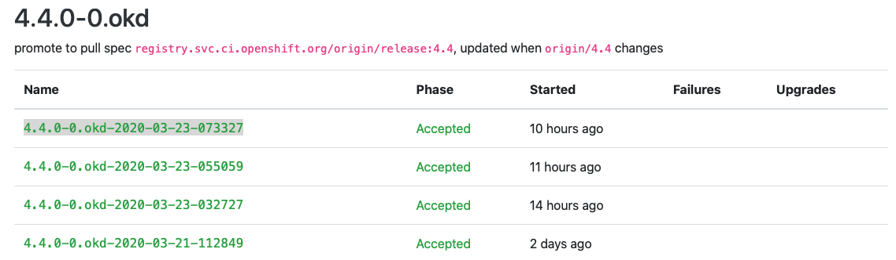

## Prepare to Install OKD 4.4

I have provided a set of utility scripts to automate a lot of the tasks associated with deploying and tearing down an OKD cluster.  In your `~/bin/lab-bin` directory you will see the following:

| | |
|-|-|
| `DeployLbNode.sh` | Creates a virtual machine that will install and configure HA-Proxy |
| `UnDeployLbNode.sh` | Destroys the load balancer VM and supporting infrastructure |
| `DeployOkdNodes.sh` | Creates the Bootstrap, Master, and Worker VMs from an inventory file, (described below) |
| `UnDeployOkdNodes.sh` | Destroys the OKD cluster and all supporting infrastructure |
| `PowerOnVms.sh` | Helper script that uses IPMI to power on the VMs listed in an inventory file |

1. Deploy the load-balancer:

       DeployLbNode.sh -h=okd4-lb01 -n=bastion -v=6228

    | | | | |
    |-|-|-|-|
    | -h | Sets Hostname: | okd4-lb01 | __*DNS `A` and `PTR` records must exist*__ |
    | -n | Sets the Hypervisor Host | bastion | |
    | -v  | Sets the VBMC Port | 6228 | |

    This will create a VM which will do a kickstart install of CentOS with HA-Proxy.  It will pull the haproxy.cfg file that we prepared earlier when we set up Nginx.  If you are curious about the installation, take a look at: 

    | | |
    |-|-|
    | `${INSTALL_ROOT}/kickstart/lb-node.ks` | The kickstart file that will direct the installation |
    | `${INSTALL_ROOT}/firstboot/lb-node.fb` | The script that will execute on the first boot to install haproxy |
    | `${INSTALL_ROOT}/haproxy.cfg` | The haproxy configuration file for our OKD cluster |

    Let's power it on and watch the installation.

       ipmitool -I lanplus -H10.11.11.10 -p6228 -Uadmin -Ppassword chassis power on
       virsh console okd4-lb01

    You should see your VM do an iPXE boot and begin an unattended installation of CentOS 7.

1. Now let's prepare to deploy the VMs for our OKD cluster by preparing the Cluster VM inventory file:

    This is not an ansible inventory like you might have encountered with OKD 3.11.  This is something I made up for my lab that allows me to quickly create, manage, and destroy virtual machines.

    I have provided an example that will create the virtual machines for this deployment.  It is located at `./Provisioning/guest_inventory/okd4_lab`.  The file is structured in such a way that it can be parsed by the utility scripts provided in this project.  The columns in the comma delimited file are used for the following purposes:

    | Column | Name | Description |
    |-|-|-|
    | 1 | KVM_HOST_NODE  | The hypervisor host that this VM will be provisioned on |
    | 2 | GUEST_HOSTNAME | The hostname of this VM, must be in DNS with `A` and `PTR` records |
    | 3 | MEMORY | The amount of RAM in MB to allocate to this VM |
    | 4 | CPU | The number of vCPUs to allocate to this VM |
    | 5 | ROOT_VOL | The size in GB of the first HDD to provision |
    | 6 | DATA_VOL | The size in GB of the second HDD to provision; `0` for none |
    | 7 | NUM_OF_NICS | The number of NICs to provision for thie VM; `1` or `2` |
    | 8 | ROLE | The OKD role that this VM will play: `BOOSTRAP`, `MASTER`, or `WORKER` |
    | 9 | VBMC_PORT | The port that VBMC will bind to for IPMI control of this VM |

    It looks like this: (The entries for the three worker nodes are commented out, if you have two KVM hosts with 64GB RAM each, then you can uncomment those lines and have a full 6-node cluster)

       bastion,okd4-bootstrap,16384,4,50,0,1,BOOTSTRAP,6229
       kvm-host01,okd4-master-0,20480,4,100,0,1,MASTER,6230
       kvm-host01,okd4-master-1,20480,4,100,0,1,MASTER,6231
       kvm-host01,okd4-master-2,20480,4,100,0,1,MASTER,6232
       # kvm-host02,okd4-worker-0,20480,4,100,0,1,WORKER,6233
       # kvm-host02,okd4-worker-1,20480,4,100,0,1,WORKER,6234
       # kvm-host02,okd4-worker-2,20480,4,100,0,1,WORKER,6235

    Copy this file into place, and modify it if necessary:

       mkdir -p ${OKD4_LAB_PATH}/guest-inventory
       cp ./Provisioning/guest_inventory/okd4_lab ${OKD4_LAB_PATH}/guest-inventory

1. Retrieve the `oc` command.  We're going to grab an older version of `oc`, but that's OK.  We just need it to retrieve to current versions of `oc` and `openshift-install`

    Go to: `https://github.com/openshift/okd/releases/tag/4.4.0-0.okd-2020-01-28-022517` and retrieve the `openshift-client-linux-4.4.0-0.okd-2020-01-28-022517.tar.gz` archive.

       wget https://github.com/openshift/okd/releases/download/4.4.0-0.okd-2020-01-28-022517/openshift-client-linux-4.4.0-0.okd-2020-01-28-022517.tar.gz

1. Uncompress the archive and move the `oc` executable to your ~/bin directory.  Make sure ~/bin is in your path.

       tar -xzf openshift-client-linux-4.4.0-0.okd-2020-01-28-022517.tar.gz
       mv oc ~/bin

    The `DeployOkdNodes.sh` script will pull the correct version of `oc` and `openshift-install` when we run it.  It will over-write older versions in `~/bin`.

1. Now, we need a couple of pull secrets.  

   The first one is for quay.io.  If you don't already have an account, go to `https://quay.io/` and create a free account.

   Once you have your account, you need to extract your pull secret.

   1. Log into your new Quay.io account.
   1. In the top left corner, click the down arrow next to your user name.  This will expand a menu
   1. Select `Account Settings`
   1. Under `Docker CLI Password`, click on `Generate Encrypted Password`
   1. Type in your quay.io password
   1. Select `Kubernetes Secret`
   1. Select `View <your-userid>-secret.yml`
   1. Copy the base64 encoded string under `.dockerconfigjson`

        It will look something like:

           ewoblahblahblahblahblahblahblahREDACTEDetc...IH0KfQ==

        But much longer...
    1. We need to put the pull secret into a JSON file that we will use to mirror the OKD images into our Nexus registry.  We'll also need the pull secret for our cluster install.

           echo "PASTE THE COPIED BASE64 STRING HERE" | base64 -d > ${OKD4_LAB_PATH}/pull_secret.json 

    So, that's the first pull secret.  The second is for our local Nexus install.  We need to push the mirrored images into our Nexus, and the OKD install will need to pull them out.

    1. Create the pull secret for Nexus.  Use a username and password that has write authority to the `origin` repository that we created earlier.

           echo -n "admin:your_admin_password" | base64 -w0

    1. Copy the resulting string, and edit the pull_secret.json file we created above.

           vi ${OKD4_LAB_PATH}/pull_secret.json

        The file should look something like:

           {"auths": {"quay.io": {"auth": "Y2dydXZlcREDACTEDrNmpiL34MVZHeGt2YpREDACTEDptNVlxS9ZTFIUREDACTEDM4bmZB", "email": ""}}}

        Add an entry for your Nexus secret, so that the file looks like this:
           
           {"auths": {"quay.io": {"auth": "Y2dydXZlcREDACTEDrNmpiL34MVZHeGt2YpREDACTEDptNVlxS9ZTFIUREDACTEDM4bmZB", "email": ""},"nexus.your.domain.org:5002": {"auth": "PASTE_NEW_SECRET_HERE", "email": ""}}}

        Save this file.

1. We need to pull a current version of OKD.  So point your browser at `https://origin-release.svc.ci.openshift.org`.  

    

    Select the most recent 4.4.0-0.okd release that is in a Phase of `Accepted`, and copy the release name into an environment variable:

       export OKD_RELEASE=4.4.0-0.okd-2020-03-23-073327

1. The next step is to prepare our install-config.yaml file that `openshift-install` will use to create the `ignition` files for bootstrap, master, and worker nodes.

    I have prepared a skeleton file for you in this project, `./Provisioning/install-config-upi.yaml`.

       apiVersion: v1
       baseDomain: %%LAB_DOMAIN%%
       metadata:
         name: okd4
       networking:
         networkType: OpenShiftSDN
         clusterNetwork:
         - cidr: 10.100.0.0/14 
           hostPrefix: 23 
         serviceNetwork: 
         - 172.30.0.0/16
         machineNetwork:
         - cidr: 10.11.11.0/24
       compute:
       - name: worker
         replicas: 0
       controlPlane:
         name: master
         replicas: 3
       platform:
         none: {}
       pullSecret: '%%PULL_SECRET%%'
       sshKey: %%SSH_KEY%%
       additionalTrustBundle: |

       imageContentSources:
       - mirrors:
         - nexus.%%LAB_DOMAIN%%:5001/origin
         source: registry.svc.ci.openshift.org/origin/%%OKD_VER%%
       - mirrors:
         - nexus.%%LAB_DOMAIN%%:5001/origin
         source: registry.svc.ci.openshift.org/origin/release

    Copy this file to our working directory.

        cp ./Provisioning/install-config-upi.yaml ${OKD4_LAB_PATH}/install-config-upi.yaml

    Patch in some values:

        sed -i "s|%%LAB_DOMAIN%%|${LAB_DOMAIN}|g" ${OKD4_LAB_PATH}/install-config-upi.yaml
        SECRET=$(cat ${OKD4_LAB_PATH}/pull-secret.json)
        sed -i "s|%%PULL_SECRET%%|${SECRET}|g" ${OKD4_LAB_PATH}/install-config-upi.yaml
        SSH_KEY=$(cat ~/.ssh/id_rsa.pub)
        sed -i "s|%%SSH_KEY%%|${SSH_KEY}|g" ${OKD4_LAB_PATH}/install-config-upi.yaml

    For the last piece, you need to manually paste in a cert.  No `sed` magic here for you...

    Copy the contents of: `/etc/pki/ca-trust/source/anchors/nexus.crt` and paste it into the blank line here in the config file:

       additionalTrustBundle: |

       imageContentSources:

    You need to indent every line of the cert with two spaces for the yaml syntax.

    Your install-config-upi.yaml file should now look something like:

       apiVersion: v1
       baseDomain: your.domain.org
       metadata:
         name: okd4
       networking:
         networkType: OpenShiftSDN
         clusterNetwork:
         - cidr: 10.100.0.0/14 
           hostPrefix: 23 
         serviceNetwork: 
         - 172.30.0.0/16
       compute:
       - name: worker
         replicas: 0
       controlPlane:
         name: master
         replicas: 3
       platform:
         none: {}
       pullSecret: '{"auths": {"quay.io": {"auth": "Y2dydREDACTEDREDACTEDHeGtREDACTEDREDACTEDU55NWV5MREDACTEDREDACTEDM4bmZB", "email": ""},"nexus.oscluster.clgcom.org:5002": {"auth": "YREDACTEDREDACTED==", "email": ""}}}'
       sshKey: ssh-rsa AAAREDACTEDREDACTEDAQAREDACTEDREDACTEDMnvPFqpEoOvZi+YK3L6MIGzVXbgo8SZREDACTEDREDACTEDbNZhieREDACTEDREDACTEDYI/upDR8TUREDACTEDREDACTEDoG1oJ+cRf6Z6gd+LZNE+jscnK/xnAyHfCBdhoyREDACTEDREDACTED9HmLRkbBkv5/2FPpc+bZ2xl9+I1BDr2uREDACTEDREDACTEDG7Ms0vJqrUhwb+o911tOJB3OWkREDACTEDREDACTEDU+1lNcFE44RREDACTEDREDACTEDov8tWSzn root@bastion
       additionalTrustBundle: |
         -----BEGIN CERTIFICATE-----
         MIIFyTREDACTEDREDACTEDm59lk0W1CnMA0GCSqGSIb3DQEBCwUAMHsxCzAJBgNV
         BAYTAlREDACTEDREDACTEDVTMREwDwYDVQQIDAhWaXJnaW5pYTEQMA4GA1UEBwwH
         A1UECgwGY2xnY29tMREwDwREDACTEDREDACTEDYDVQQLDAhva2Q0LWxhYjEjMCEG
         b3NjbHVzdGVyLmNsZ2NvbS5vcmcwHhcNMjAwMzREDACTEDREDACTEDE0MTYxMTQ2
         MTQ2WREDACTEDREDACTEDjB7MQswCQYDVQQGEwJVUzERMA8GA1UECAwIVmlyZ2lu
         B1JvYW5va2UxDzANBgNVBREDACTEDREDACTEDAoMBmNsZ2NvbTERMA8GA1UECwwI
         BgNVBAMMGm5leHVzLm9zY2x1c3Rlci5jbGdjbREDACTEDREDACTED20ub3JnMIIC
         REDACTEDREDACTEDAQEFAAOCAg8AMIICCgKCAgEAwwnvZEW+UqsyyWwHS4rlWbcz
         hmvMMBXEXqNqSp5sREDACTEDREDACTEDlYrjKIBdLa9isEfgIydtTWZugG1L1iA4
         hgdAlW83s8wwKW4bbEd8iDZyUFfzmFSKREDACTEDREDACTEDTrwk9JcH+S3/oGbk
         9iq8oKMiFkz9loYxTu93/p/iGieTWMFGajbAuUPjZsBYgbf9REDACTEDREDACTED
         REDACTEDREDACTEDYlFMcpkdlfYwJbJcfqeXAf9Y/QJQbBqRFxJCuXzr/D5Ingg3
         HrXXvOr612LWHFvZREDACTEDREDACTEDYj7JRKKPKXIA0NHA29Db0TdVUzDi3uUs
         WcDBmIpfZTXfrHG9pcj1CbOsw3vPhD4mREDACTEDREDACTEDCApsGKET4FhnFLkt
         yc2vpaut8X3Pjep821pQznT1sR6G1bF1eP84nFhL7qnBdhEwREDACTEDREDACTED
         REDACTEDREDACTEDIuOZH60cUhMNpl0uMSYU2BvfVDKQlcGPUh7pDWWhZ+5I1pei
         KgWUMBT/j3KAJNgFREDACTEDREDACTEDX43aDvUxyjbDg8FyjBGY1jdS8TnGg3YM
         zGP5auSqeyO1yZ2v3nbr9xUoRTVuzPUwREDACTEDREDACTED0SfiaeGPczpNfT8f
         6H0CAwEAAaNQME4wHQYDVR0OBBYEFPAJpXdtNX0bi8dh1QMsREDACTEDREDACTED
         REDACTEDREDACTEDIwQYMBaAFPAJpXdtNX0bi8dh1QMsE1URxd8tMAwGA1UdEwQF
         hvcNAQELBQADggIBREDACTEDREDACTEDAAx0CX20lQhP6HBNRl7C7IpTEBpds/4E
         dHuDuGMILaawZTbbKLMTlGu01Y8uCO/3REDACTEDREDACTEDUVZeX7X9NAw80l4J
         kPtLrp169L/09F+qc8c39jb7QaNRWenrNEFFJqoLRakdXM1MREDACTEDREDACTED
         REDACTEDREDACTED5CAWBCRgm67NhAJlzYOyqplLs0dPPX+kWdANotCfVxDx1jRM
         8tDL/7kurJA/wSOLREDACTEDREDACTEDDCaNs205/nEAEhrHLr8NHt42/TpmgRlg
         fcZ7JFw3gOtsk6Mi3XtS6rxSKpVqUWJ8REDACTEDREDACTED3nafC2IQCmBU2KIZ
         3Oir8xCyVjgf4EY/dQc5GpIxrJ3dV+U2Hna3ZsiCooAdq957REDACTEDREDACTED
         REDACTEDREDACTED57krXJy+4z8CdSMa36Pmc115nrN9Ea5C12d6UVnHnN+Kk4cL
         Wr9ZZSO3jDiwuzidREDACTEDREDACTEDk/IP3tkLtS0s9gWDdHdHeW0eit+trPib
         Oo9fJIxuD246HTQb+51ZfrvyBcbAA/M3REDACTEDREDACTED06B/Uq4CQMjhRwrU
         aUEYgiOJjUjLXGJSuDVdCo4J9kpQa5D1bUxcHxTp3R98CasnREDACTEDREDACTED
         -----END CERTIFICATE-----
       imageContentSources:
       - mirrors:
         - nexus.your.domain.org:5001/origin
         source: registry.svc.ci.openshift.org/origin/%%OKD_VER%%
       - mirrors:
         - nexus.your.domain.org:5001/origin
         source: registry.svc.ci.openshift.org/origin/release

2. Now mirror the OKD images into the local Nexus:

       oc adm -a ${LOCAL_SECRET_JSON} release mirror --from=${OKD_REGISTRY}:${OKD_RELEASE} --to=${LOCAL_REGISTRY}/${LOCAL_REPOSITORY} --to-release-image=${LOCAL_REGISTRY}/${LOCAL_REPOSITORY}:${OKD_RELEASE}

    The output should look something like:

       Success
       Update image:  nexus.oscluster.clgcom.org:5002/origin:4.4.0-0.okd-2020-03-11-174228
       Mirror prefix: nexus.oscluster.clgcom.org:5002/origin

       To use the new mirrored repository to install, add the following section to the install-config.yaml:

       imageContentSources:
       - mirrors:
         - nexus.oscluster.clgcom.org:5002/origin
         source: registry.svc.ci.openshift.org/origin/4.4-2020-03-13-191636
       - mirrors:
         - nexus.oscluster.clgcom.org:5002/origin
         source: registry.svc.ci.openshift.org/origin/release

       To use the new mirrored repository for upgrades, use the following to create an ImageContentSourcePolicy:

       apiVersion: operator.openshift.io/v1alpha1
       kind: ImageContentSourcePolicy
       metadata:
         name: example
       spec:
         repositoryDigestMirrors:
         - mirrors:
           - nexus.oscluster.clgcom.org:5002/origin
           source: registry.svc.ci.openshift.org/origin/4.4-2020-03-13-191636
         - mirrors:
           - nexus.oscluster.clgcom.org:5002/origin
           source: registry.svc.ci.openshift.org/origin/release

3. Create the cluster virtual machines and set up for OKD installation:

       DeployOkdNodes.sh -i=${OKD4_LAB_PATH}/guest-inventory/okd4 -p -m -d1

    This script does a whole lot of work for us.

    1. It will pull the current versions of `oc` and `openshift-install` based on the value of `${OKD_RELEASE}` that we set previously.
    2. fills in the OKD version in the install-config-upi.yaml file and copies that file to the install directory as install-config.yaml.
    3. Invokes the openshift-install command against our install-config to produce ignition files
    4. Copies the ignition files into place for FCOS install
    5. Sets up for a mirrored install by putting `registry.svc.ci.openshift.org` into a DNS sinkhole.
    6. Creates guest VMs based on the inventory file at `${OKD4_LAB_PATH}/guest-inventory/okd4`
    7. Creates DHCP reservations for each VM
    8. Creates iPXE boot files for each VM and copies them to the iPXE server, (your router)

# We are now ready to fire up our OKD cluster!!!

1. Start the LB

       ipmitool -I lanplus -H10.11.11.10 -p6228 -Uadmin -Ppassword chassis power on

1. Start the bootstrap node

       ipmitool -I lanplus -H10.11.11.10 -p6229 -Uadmin -Ppassword chassis power on

1. Start the cluster master nodes

       for i in 6230 6231 6232
       do
         ipmitool -I lanplus -H10.11.11.10 -p${i} -Uadmin -Ppassword chassis power on
       done

1. Start the cluster worker nodes (If you have any)

       for i in 6233 6234 6235
       do
         ipmitool -I lanplus -H10.11.11.10 -p${i} -Uadmin -Ppassword chassis power on
       done

### Now let's sit back and watch the install:

* To watch a node boot and install:
  * Bootstrap node from the Bastion host:
  
         virsh console okd4-bootstrap

  * Master Node from `kvm-host01`

         virsh console okd4-master-0

* Once a host has installed FCOS:
  * Bootstrap Node:

        ssh -o StrictHostKeyChecking=no -o UserKnownHostsFile=/dev/null core@okd4-bootstrap "journalctl -b -f -u bootkube.service"

  * Master Node:

        ssh -o StrictHostKeyChecking=no -o UserKnownHostsFile=/dev/null core@okd4-master-0 "journalctl -b -f -u kubelet.service"

* Monitor OKD install progress:
  * Bootstrap Progress:

        openshift-install --dir=${OKD4_LAB_PATH}/okd4-install-dir wait-for bootstrap-complete --log-level debug

  * When bootstrap is complete, remove the bootstrap node from HA-Proxy

        ssh root@okd4-lb01 "cat /etc/haproxy/haproxy.cfg | grep -v bootstrap > /etc/haproxy/haproxy.tmp && mv /etc/haproxy/haproxy.tmp /etc/haproxy/haproxy.cfg && systemctl restart haproxy.service"

    Destroy the Bootstrap Node on the Bastion host:

        virsh destroy okd4-bootstrap
        vbmc delete okd4-bootstrap

  * Install Progress:

        openshift-install --dir=${OKD4_LAB_PATH}/okd4-install-dir wait-for install-complete --log-level debug

* Install Complete:

    You will see output that looks like:

      INFO Waiting up to 10m0s for the openshift-console route to be created... 
      DEBUG Route found in openshift-console namespace: console 
      DEBUG Route found in openshift-console namespace: downloads 
      DEBUG OpenShift console route is created           
      INFO Install complete!                            
      INFO To access the cluster as the system:admin user when using 'oc', run 'export KUBECONFIG=/root/okd4-lab/okd4-install-dir/auth/kubeconfig' 
      INFO Access the OpenShift web-console here: https://console-openshift-console.apps.okd4.your.domain.org 
      INFO Login to the console with user: kubeadmin, password: aBCdE-FGHiJ-klMNO-PqrSt

### Log into your new cluster console:

Point your browser to the url listed at the completion of install: `https://console-openshift-console.apps.okd4.your.domain.org`
Log in as `kubeadmin` with the password from the output at the completion of the install.

__If you forget the password for this initial account, you can find it in the file: `${OKD4_LAB_PATH}/okd4-install-dir/auth/kubeadmin-password`

__Note: the first time you try to log in, you may have to wait a couple of minutes for all of the console resources to initialize.__

You will have to accept the certs for your new cluster, and you may see a screen that looks like:

### Issue commands against your new cluster:

    export KUBECONFIG="${OKD4_LAB_PATH}/okd4-install-dir/auth/kubeconfig"
    oc get pods --all-namespaces

You may need to approve the certs of you master and or worker nodes before they can join the cluster:

    oc get csr

If you see certs in a Pending state:

    oc get csr -ojson | jq -r '.items[] | select(.status == {} ) | .metadata.name' | xargs oc adm certificate approve

Create an Empty volume for registry storage:

    oc patch configs.imageregistry.operator.openshift.io cluster --type merge --patch '{"spec":{"managementState":"Managed","storage":{"emptyDir":{}}}}'

### If it all goes pancake shaped:

    openshift-install --dir=okd4-install gather bootstrap --bootstrap 10.11.11.49 --master 10.11.11.60 --master 10.11.11.61 --master 10.11.11.62

Next: [Updating Your Cluster](UpdateOKD.md)