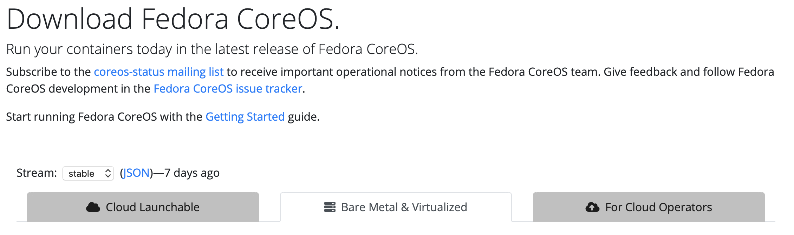

## Nginx Config & RPM Repository Synch
We are going to install the Nginx HTTP server and configure it to serve up all of the RPM packages that we need to build our guest VMs.

We'll use the reposync and createrepo utilities to copy RPM repository contents from remote mirrors into our Nginx server.

We are also going to copy the CentOS minimal install ISO into our Nginx server. 

If you look at the contents of `/etc/yum.repos.d`, you should see files called `CentOS-Base.repo` and `epel.repo`.  These files contain the specifications for the repositories that we are going to synchronize.  `base, updates, extras, centosplus, and epel`

We need to open firewall ports for HTTP/S so that we can access our Nginx server:

    firewall-cmd --permanent --add-service=http
    firewall-cmd --permanent --add-service=https
    firewall-cmd --reload

Install and start Nginx:

    yum -y install nginx
    systemctl enable nginx
    systemctl start nginx

### RPM Repository Mirror

Create directories to hold all of the RPMs:

    mkdir -p /usr/share/nginx/html/repos/{base,centosplus,extras,updates,kvm-common,epel}

Synch the repositories into the directories we just created:  (This will take a while)

    LOCAL_REPOS="base centosplus extras updates epel kvm-common"
    for REPO in ${LOCAL_REPOS}
    do
        reposync -l -g -d -m --repoid=${REPO} --newest-only --download-metadata --download_path=/usr/share/nginx/html/repos/
        createrepo /usr/share/nginx/html/repos/${REPO}/  
    done

Our Nginx server is now ready to serve up CentOS RPMs.

To refresh your RPM repositories, run the above script again, or better yet, create a cron job to run it periodically.

### Host installation, FCOS & CentOS

Now, we are going to set up the artifacts for host installation.  This will include FCOS via `ignition`, and CentOS via `kickstart`.

    mkdir -p /usr/share/nginx/html/install/{centos,fcos,firstboot,kickstart,hostconfig,postinstall}
    mkdir /usr/share/nginx/html/install/fcos/ignition

### CentOS:

1. Deploy the Minimal ISO files.

       wget https://buildlogs.centos.org/rolling/7/isos/x86_64/CentOS-7-x86_64-Minimal.iso
       mkdir /tmp/centos-iso-mount
       mount -o loop CentOS-7-x86_64-Minimal.iso /tmp/centos-iso-mount
       rsync -av /tmp/centos-iso-mount/ ${INSTALL_ROOT}/centos/
       umount /tmp/centos-iso-mount
       rmdir /tmp/centos-iso-mount
       rm CentOS-7-x86_64-Minimal.iso

1. Copy the UEFI PXE boot files to the router:

       scp ${INSTALL_ROOT}/centos/EFI/BOOT/grubx64.efi root@${LAB_GATEWAY}:/data/tftpboot/
       scp ${INSTALL_ROOT}/centos/EFI/BOOT/BOOTX64.EFI root@${LAB_GATEWAY}:/data/tftpboot/
       ssh root@${LAB_GATEWAY} "mkdir /data/tftpboot/networkboot"
       scp ${INSTALL_ROOT}/centos/isolinux/vmlinuz root@${LAB_GATEWAY}:/data/tftpboot/networkboot
       scp ${INSTALL_ROOT}/centos/isolinux/initrd.img root@${LAB_GATEWAY}:/data/tftpboot/networkboot

1. Deploy the files from this project for supporting `kickstart` installation.

    Make a temporary work space:

       mkdir tmp-work

    Create as initial root password for installed hosts

       export LAB_PWD=$(openssl passwd -1 '<YourRootPasswordHere>')

    Prep the install files from this project:

       cp -rf ./Provisioning/Infrastructure/kickstart ./tmp-work 
       cp -rf ./Provisioning/Infrastructure/firstboot ./tmp-work
       cp -rf ./Provisioning/Infrastructure/postinstall ./tmp-work
       for i in $(ls ./tmp-work/kickstart)
       do
          sed -i "s|%%INSTALL_URL%%|${INSTALL_URL}|g" ./tmp-work/kickstart/${i}
          sed -i "s|%%LAB_PWD%%|${LAB_PWD}|g" ./tmp-work/kickstart/${i}
       done

       for i in $(ls ./tmp-work/firstboot)
       do
         sed -i "s|%%INSTALL_URL%%|${INSTALL_URL}|g" ./tmp-work/firstboot/${i}
         sed -i "s|%%REPO_URL%%|${REPO_URL}|g" ./tmp-work/firstboot/${i}
         sed -i "s|%%LAB_DOMAIN%%|${LAB_DOMAIN}|g" ./tmp-work/firstboot/${i}
       done

       sed -i "s|%%REPO_URL%%|${REPO_URL}|g" ./tmp-work/postinstall/local-repos.repo

    Copy your public SSH key

       cat ~/.ssh/id_rsa.pub > ./tmp-work/postinstall/authorized_keys

    Copy the prepared files into place
    
       scp -r ./tmp-work/kickstart root@${INSTALL_HOST_IP}:${INSTALL_ROOT}
       scp -r ./tmp-work/firstboot root@${INSTALL_HOST_IP}:${INSTALL_ROOT}
       scp -r ./tmp-work/postinstall root@${INSTALL_HOST_IP}:${INSTALL_ROOT}
       rm -rf ./tmp-work

### FCOS:

1. In a browser, go to: `https://getfedora.org/en/coreos/download/`
1. Make sure you are on the `stable` Stream, select the `Bare Metal & Virtualized` tab, and make note of the current version. 

    

1. Set the FCOS version as a variable.  For example:

       FCOS_VER=31.20200223.3.0

1. Set the FCOS_STREAM variable to `stable` or `testing` to match the stream that you are pulling from.

    FCOS_STREAM=stable

1. Download the FCOS images for iPXE booting:

       curl -o /tmp/fcos.iso https://builds.coreos.fedoraproject.org/prod/streams/testing/builds/31.20200505.2.0/x86_64/fedora-coreos-31.20200505.2.0-live.x86_64.iso
       mkdir /tmp/fcos
       mount -o loop /tmp/fcos.iso /tmp/fcos
       mkdir -p ${INSTALL_ROOT}/fcos/iso
       rsync -av /tmp/fcos/ ${INSTALL_ROOT}/fcos/iso/
       umount /tmp/fcos
       rm -rf /tmp/fcos
       rm -f /tmp/fcos.iso

       mkisofs -o /tmp/bootstrap.iso -b isolinux/isolinux.bin -c isolinux/boot.cat -no-emul-boot -boot-load-size 4 -boot-info-table -J -r $PWD

       
       curl -o ${INSTALL_ROOT}/fcos/vmlinuz https://builds.coreos.fedoraproject.org/prod/streams/${FCOS_STREAM}/builds/${FCOS_VER}/x86_64/fedora-coreos-${FCOS_VER}-live-kernel-x86_64
       curl -o ${INSTALL_ROOT}/fcos/initrd https://builds.coreos.fedoraproject.org/prod/streams/${FCOS_STREAM}/builds/${FCOS_VER}/x86_64/fedora-coreos-${FCOS_VER}-live-initramfs.x86_64.img
       curl -o ${INSTALL_ROOT}/fcos/install.xz https://builds.coreos.fedoraproject.org/prod/streams/${FCOS_STREAM}/builds/${FCOS_VER}/x86_64/fedora-coreos-${FCOS_VER}-metal.x86_64.raw.xz
       curl -o ${INSTALL_ROOT}/fcos/install.xz.sig https://builds.coreos.fedoraproject.org/prod/streams/${FCOS_STREAM}/builds/${FCOS_VER}/x86_64/fedora-coreos-${FCOS_VER}-metal.x86_64.raw.xz.sig

Now, continue on to set up your Nexus: [Sonatype Nexus Setup](Nexus_Config.md)
